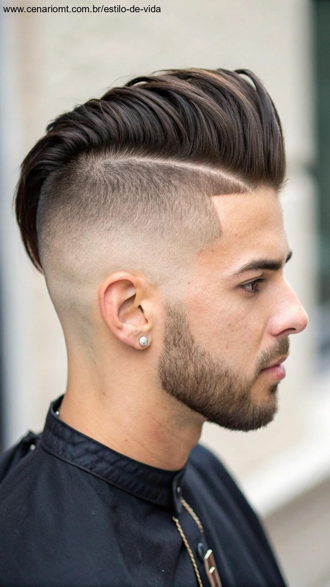
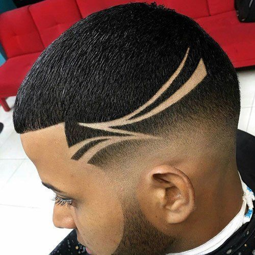

# Barbearia TecStyle 💈

Projeto desenvolvido com Angular para uma barbearia fictícia, focado em apresentar uma interface simples e funcional.

## 🚀 Tecnologias utilizadas
- **Angular 17** - Framework para o desenvolvimento do front-end.
- **HTML5** - Estruturação das páginas.
- **CSS3** - Estilização e responsividade.
- **TypeScript** - Linguagem para garantir uma codificação mais robusta e segura.

## 💻 Imagens do Projeto

<div style="display: flex; gap: 10px;">
  
  
  
</div>

## 📂 Como executar

1. Clone o repositório:
    ```bash
    git clone https://github.com/seu-usuario/barbearia-tecstyle.git
    ```

2. Instale as dependências:
    ```bash
    cd barbearia-tecstyle
    npm install
    ```

3. Execute o projeto em modo de desenvolvimento:
    ```bash
    ng serve
    ```

4. Acesse no navegador:
    ```
    http://localhost:4200
    ```

## ⚙️ Como rodar no ambiente de produção

1. Compile o projeto para produção:
    ```bash
    ng build --prod
    ```

2. Acesse a pasta `dist` e hospede os arquivos gerados.

## 🤝 Contribuição

Sinta-se à vontade para fazer fork deste repositório e enviar pull requests com melhorias!

---

## 📄 Licença

Este projeto está licenciado sob a MIT License - veja o arquivo [LICENSE](LICENSE) para mais detalhes.
